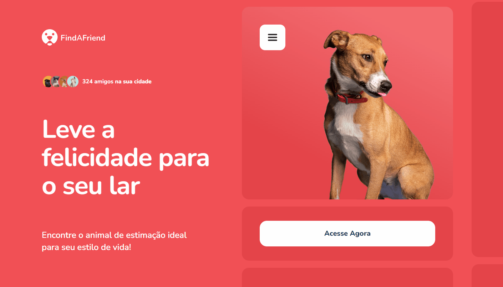

<h1 align="center"> Sprint #1 Green Chain Challenge </h1>

Criação de uma página para a empresa Find a Friend para o desafio da <a href="https://https://www.rocketseat.com.br/">RocketSeat</a>  

  <a href="#-tecnologias">Tecnologias</a>&nbsp;&nbsp;&nbsp;|&nbsp;&nbsp;&nbsp;
  <a href="#-projeto">Projeto</a>&nbsp;&nbsp;&nbsp;|&nbsp;&nbsp;&nbsp;
  <a href="#-layout">Layout</a>&nbsp;&nbsp;&nbsp;|&nbsp;&nbsp;&nbsp;
  <a href="#-collaborators">Collaborators</a>&nbsp;&nbsp;&nbsp;|&nbsp;&nbsp;&nbsp;

 

  

## 🚀 Tecnologias

Esse projeto foi desenvolvido com as seguintes tecnologias:

- HTML
- CSS
- JavaScript
- Git e Github
- Figma

## 💻 Projeto

O projeto foi realizado como parte do #1 Sprint do desafio #Green Chain Challenge da RocketSeat.

_<h2 align="center" ><a href="https://green-chain-challange-01.vercel.app/" target="_blank">Visite o projeto online</a></h2>_

## 📃 Collaborators

This challange was made by [Ricardo](https://rickazuo.github.io/portfolio/)
